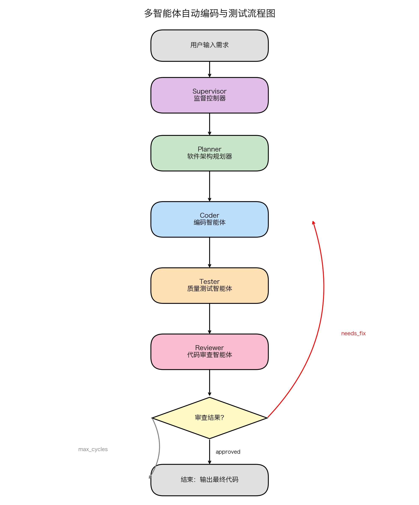

# Mini-Coding-Agent 使用指南

本项目是一个基于 LangGraph 的多智能体编码助手，支持**单智能体**和**多智能体（规划器 + 编码器 + 测试器 + 审查器）**两种模式。以下以**二分查找**为例介绍如何用它来**自动编写代码并自动测试**。

---

## 一、环境准备

### 1. 安装依赖

```bash
# 使用 uv 安装（推荐）
uv pip install -e .

# 或使用 pip
pip install -e .
```

### 2. 启动模型服务

#### 方式 A：使用 Ollama（本地模型，默认）

```bash
# 启动 Ollama 服务
ollama serve

# 拉取模型（以 qwen3.5:4b 为例）
ollama pull qwen3.5:4b
```

#### 方式 B：使用 OpenAI 兼容 API（如 GPT-4、Claude 等）

无需本地模型，通过配置 `api_key` 和 `base_url` 即可使用在线 API。

---

## 二、使用单智能体模式编写并测试二分查找

单智能体模式适合快速任务，一个智能体即可完成代码编写和测试。

### 1. 交互模式

```bash
python -m mini_coding_agent \
  --model qwen3.5:4b \
  --approval auto
```

进入交互界面后输入：

```
请编写一个二分查找函数 binary_search(nums, target)，要求：
1. 如果找到目标值，返回其索引；
2. 如果未找到，返回 -1；
3. 编写 pytest 测试文件 tests/test_binary_search.py，覆盖正常查找、边界值、空数组等情况；
4. 运行测试并确保全部通过。
```

### 2. 一次性命令模式（非交互）

```bash
python -m mini_coding_agent \
  --model qwen3.5:4b \
  --approval auto \
  --max-steps 10 \
  "请编写二分查找函数 binary_search(nums, target) 并保存到 src/binary_search.py，同时编写 tests/test_binary_search.py 进行 pytest 测试，确保测试通过。"
```

---

## 三、使用多智能体模式编写并测试二分查找（推荐）

多智能体模式会自动调用 **规划器（Planner）→ 编码器（Coder）→ 测试器（Tester）→ 审查器（Reviewer）** 的流水线，自动完成规划、编码、测试和审查，更适合复杂任务。

### 多智能体流程图



**流程说明：**

1. **Supervisor**：接收用户请求，按顺序调度各智能体
2. **Planner**：分析需求，制定实现计划（只读，不写代码）
3. **Coder**：根据计划编写代码和测试文件（可写入文件）
4. **Tester**：运行测试、验证功能、检查边界条件（只读）
5. **Reviewer**：审查代码和测试报告，给出 `approved` 或 `needs_fix`  verdict
6. **循环修复**：若审查未通过，Coder 根据反馈自动修复，最多循环 **3 次**

### 1. 使用 Ollama 运行

```bash
python -m mini_coding_agent \
  --mode multi \
  --model qwen3.5:4b \
  --approval auto \
  --max-steps 10 \
  "请实现一个健壮的二分查找算法 binary_search(nums, target)，包含完整的单元测试和边缘情况处理。"
```

### 2. 使用 OpenAI 兼容 API 运行

```bash
python -m mini_coding_agent \
  --mode multi \
  --model gpt-4o-mini \
  --api-key "sk-your-api-key" \
  --base-url "https://api.openai.com/v1" \
  --approval auto \
  --max-steps 10 \
  "请实现一个健壮的二分查找算法 binary_search(nums, target)，包含完整的单元测试和边缘情况处理。"
```

---

## 四、常用命令行参数说明

| 参数 | 说明 | 示例 |
|------|------|------|
| `--mode` | 运行模式：`single`（单智能体）或 `multi`（多智能体） | `--mode multi` |
| `--model` | 模型名称 | `--model qwen3.5:4b` |
| `--host` | Ollama 服务地址（默认 `http://127.0.0.1:11434`） | `--host http://localhost:11434` |
| `--api-key` | OpenAI 兼容 API 的密钥 | `--api-key sk-xxx` |
| `--base-url` | OpenAI 兼容 API 的基础地址 | `--base-url https://api.openai.com/v1` |
| `--approval` | 风险操作审批策略：`ask`（询问）、`auto`（自动）、`never`（禁止） | `--approval auto` |
| `--max-steps` | 每个智能体的最大工具调用步数 | `--max-steps 10` |
| `--max-new-tokens` | 每次模型生成的最大 token 数 | `--max-new-tokens 1024` |
| `--config` | 指定 YAML 配置文件路径 | `--config config/default.yaml` |

---

## 五、使用自定义配置文件

项目支持通过 YAML 文件统一管理配置。示例配置文件 `config/default.yaml`：

```yaml
model:
  name: "qwen3.5:4b"
  host: "http://127.0.0.1:11434"
  temperature: 0.2
  top_p: 0.9
  timeout: 300
  max_new_tokens: 512

agent:
  max_steps: 6
  approval_policy: "ask"

multi_agent:
  max_steps_planner: 15
  max_steps_coder: 10
  max_steps_tester: 5
  max_steps_reviewer: 5
```

使用配置文件运行：

```bash
python -m mini_coding_agent \
  --config config/default.yaml \
  --mode multi \
  --approval auto \
  "请实现二分查找算法并编写测试。"
```

---

## 六、交互式命令

进入交互模式后，可使用以下命令：

| 命令 | 说明 |
|------|------|
| `/help` | 显示帮助信息 |
| `/memory` | 查看智能体的工作记忆 |
| `/session` | 查看当前会话文件路径 |
| `/reset` | 清空当前会话历史和记忆 |
| `/exit` | 退出程序 |

---

## 七、注意事项

1. **模型能力**：较小的本地模型（如 4B）可能无法一次生成完全正确的代码，建议增加 `--max-steps` 或更换更强的模型。
2. **自动审批**：`--approval auto` 会自动批准所有文件写入和命令执行，仅在信任的环境中使用。
3. **Ollama 超时**：如果模型推理较慢，可通过 `--ollama-timeout` 增加超时时间（默认 300 秒）。
4. **测试依赖**：运行 pytest 需要环境中已安装 `pytest`，可通过 `uv add --dev pytest` 或 `pip install pytest` 安装。

---

> **声明**：该项目基于 [mini-coding-agent](https://github.com/rasbt/mini-coding-agent) 做进一步研发。
